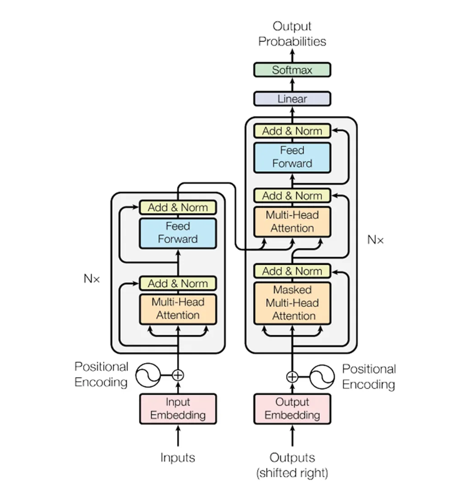
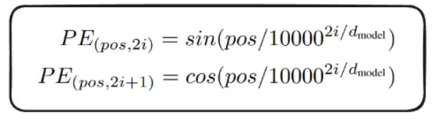
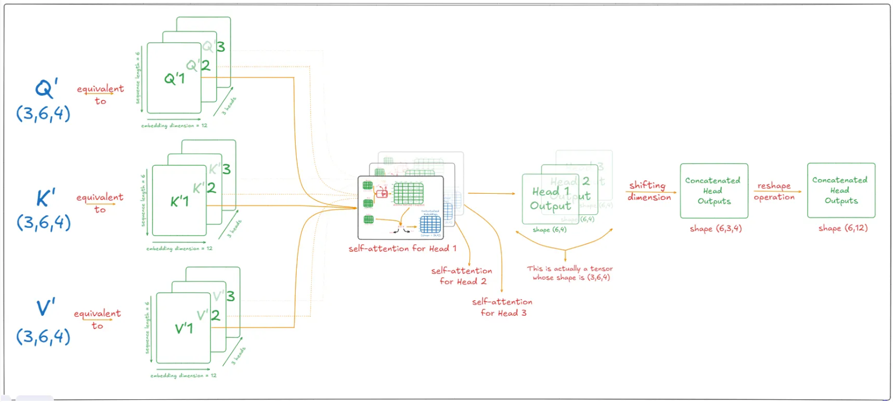

# Transformer from Scratch — English to Italian Translation

A full implementation of the original **"Attention Is All You Need"** (Vaswani et al., 2017) Transformer architecture in PyTorch, built for sequence-to-sequence translation from English to Italian.

This project was built as a deep-dive study into Transformer internals — every component is implemented from scratch without using any high-level `nn.Transformer` abstractions.

---

## 📝 Companion Blog Series

Alongside this implementation, I wrote a detailed blog series explaining the theory and intuition behind every component:

| Part | Topic | Link |
|---|---|---|
| **Part 1** | Why Attention is All You Need — Deep dive into the **Encoder**: embeddings, positional encoding, self-attention, multi-head attention, FFN, residual connections | [Read on Medium →](https://medium.com/@arunim756/why-attention-is-all-you-need-c78c2f466b61) |
| **Part 2** | The Decoder, Cross-Attention & Training *(coming soon)* | — |

> Part 1 is a **26-minute read** covering the full encoder stack with diagrams and intuition — written to complement the code here.

---


## Architecture Overview

The model follows the classic encoder-decoder structure where:

- The **Encoder** reads the source sentence (English) and builds a rich contextual representation of it.
- The **Decoder** takes that representation and generates the target sentence (Italian) one token at a time.

Both the encoder and decoder use **Multi-Head Self-Attention** as their core building block, allowing every token to attend to every other token in the sequence simultaneously.

---

## Components Implemented

### 1. Input Embeddings
Converts token IDs into dense vectors of size `d_model`. Following the paper, embeddings are scaled by `√d_model` before being passed forward. This scaling prevents the dot-product magnitudes in attention from growing too large relative to the positional signal.

---

### 2. Positional Encoding



Since the Transformer has no recurrence, positional information is injected using fixed sinusoidal encodings:

$$PE_{(pos, 2i)} = \sin\left(\frac{pos}{10000^{2i/d_{model}}}\right), \quad PE_{(pos, 2i+1)} = \cos\left(\frac{pos}{10000^{2i/d_{model}}}\right)$$

- Applied to **even** dimensions using `sin`, **odd** dimensions using `cos`
- Computed using the log-space formulation for numerical stability
- Stored as a **buffer** (not a learnable parameter) so it's saved with the model but not updated during training

---

### 3. Multi-Head Attention



The attention mechanism computes:

$$\text{Attention}(Q, K, V) = \text{softmax}\left(\frac{QK^T}{\sqrt{d_k}}\right)V$$

Key implementation details:
- Q, K, V are each projected via separate `nn.Linear` layers (`W_q`, `W_k`, `W_v`)
- The `d_model`-dimensional space is split into `h` heads, each operating on a `d_k = d_model / h` subspace
- Outputs from all heads are concatenated and passed through a final projection `W_o`
- A **mask** is applied before softmax (filling masked positions with `-1e9`) to handle padding and causality
- The `attention` method is implemented as `@staticmethod` so it can be called without instantiating the class — useful for reuse in both self-attention and cross-attention

---

### 4. Layer Normalization

Custom implementation with learnable parameters `alpha` (scale) and `bias` (shift), both initialized to neutral values (`1` and `0`). A small `eps = 1e-6` is added to the standard deviation for numerical safety.

**Note:** This implementation uses **Pre-Norm** (normalize → sublayer → residual add), which differs slightly from the original paper's Post-Norm but is more stable during training and widely adopted in practice.

---

### 5. Feed-Forward Block

A two-layer MLP applied position-wise:

```
d_model → d_ff → d_model
```

Uses ReLU activation and dropout between the two linear layers. Each position in the sequence is passed through the same FFN independently.

---

### 6. Residual Connections

Each sub-layer (attention or FFN) is wrapped in a residual connection:

```
output = x + Dropout(sublayer(Norm(x)))
```

The lambda function trick in `EncoderBlock.forward` is used to defer attention's multi-argument call through the single-argument `sublayer` interface of `ResidualConnection`.

---

### 7. Encoder

A stack of `N` `EncoderBlock`s, each containing:
- Multi-Head Self-Attention (with source padding mask)
- Position-wise Feed-Forward Block
- Two Residual Connections

The output of one encoder block feeds directly into the next. A final `LayerNormalization` is applied after all blocks.

---

### 8. Decoder

A stack of `N` `DecoderBlock`s, each containing:
- **Masked** Multi-Head Self-Attention (causal mask prevents attending to future tokens)
- **Cross-Attention** (queries from decoder, keys & values from encoder output)
- Position-wise Feed-Forward Block
- Three Residual Connections


The **causal mask** is a lower-triangular boolean matrix built using `torch.triu(..., diagonal=1)`, ensuring that during training, the decoder at position `t` can only attend to positions `0..t`.

---

### 9. Projection Layer

A linear layer mapping from `d_model → vocab_size`, followed by `log_softmax`. The log form is used for numerical stability when combined with `NLLLoss`, or equivalently with `CrossEntropyLoss` on raw logits.

---

### 10. Dataset — `BillingualDataset`

A custom `torch.utils.data.Dataset` for bilingual sentence pairs. For each pair it:
- Tokenizes source and target sentences using BPE tokenizers
- Pads sequences to a fixed `seq_len`
- Constructs the encoder input (`[SOS] + tokens + [EOS] + [PAD]...`)
- Constructs the decoder input (`[SOS] + tokens + [PAD]...`)
- Constructs the label (`tokens + [EOS] + [PAD]...`)
- Builds encoder and decoder masks

---

## Model Configuration

| Parameter | Value |
|---|---|
| `d_model` | 256 |
| `d_ff` | 512 |
| `seq_len` | 350 |
| `N` (encoder/decoder layers) | 6 (paper default) |
| `h` (attention heads) | 8 (paper default) |
| `dropout` | 0.1 |
| `batch_size` | 2 |
| `learning_rate` | 1e-3 |
| Source language | English (`en`) |
| Target language | Italian (`it`) |

All parameters are centrally managed in `config.py` via `get_config()`.

---

## Project Structure

```
Transformers-from-Scratch/
├── model.py          # Full Transformer implementation
├── dataset.py        # BillingualDataset and causal mask
├── config.py         # Hyperparameters and weight path helpers
├── train.py          # Training loop
├── demo/             # Demo scripts
├── demo.ipynb        # Interactive demo notebook
└── requirements.txt
```

---

## Setup & Usage

```bash
# Clone the repo
git clone https://github.com/Arunim10/Transformers-from-Scratch.git
cd Transformers-from-Scratch

# Install dependencies
pip install -r requirements.txt

# Train the model
python train.py
```

Weights are saved after each epoch to the `weights/` folder as `tmodel_{epoch}.pt`. To resume training from a checkpoint, set `"preload"` to the desired epoch string in `config.py`.

---

## Key Concepts Covered

- Scaled dot-product attention and why the `√d_k` scaling matters
- Why positional encoding uses the log-space formulation
- The difference between self-attention, masked self-attention, and cross-attention
- Pre-Norm vs Post-Norm residual connections
- Why `register_buffer` is used for positional encodings
- Xavier uniform initialization for faster convergence
- Causal masking for autoregressive decoding

---

## References & Acknowledgements

- **Paper:** [Attention Is All You Need](https://arxiv.org/abs/1706.03762) — Vaswani et al., 2017
- **Tutorial:** [Coding a Transformer from scratch on PyTorch](https://www.youtube.com/watch?v=ISNdQcPhsts) — Umar Jamil
- The code in this repository is based on Umar Jamil's implementation, studied and annotated as a learning exercise to understand Transformer internals from the ground up.